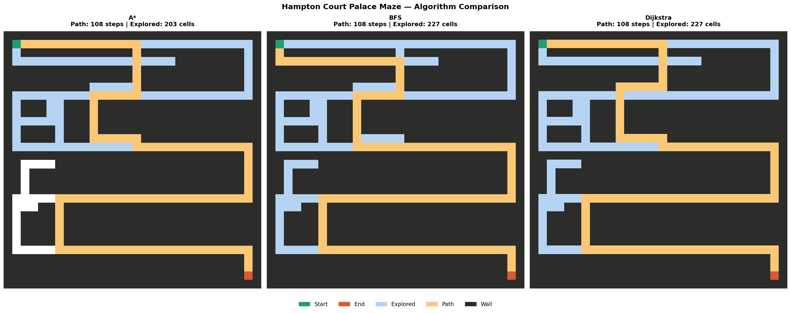

# Path Planning Visualizer

A visual comparison of four pathfinding algorithms A*, BFS, Dijkstra, and Greedy Best-First Search navigating a maze inspired by the **Hampton Court Palace Maze** in Surrey, UK. Hampton Court's hedge maze is one of the oldest and most famous labyrinths in England, known for its winding dead ends and deceptive corridors that have been confusing visitors since the 1690s.



## Algorithms

| Algorithm | Strategy | Finds Shortest Path? | Notes |
|-----------|----------|----------------------|-------|
| **A\*** | Heuristic Guided (Manhattan distance) | Yes | Balances speed and optimality |
| **BFS** | Level by Level exploration | Yes | Guarantees shortest path, explores broadly |
| **Dijkstra** | Lowest cost first | Yes | Equivalent to BFS on uniform cost grids |
| **Greedy** | Always moves toward goal | No | Fastest to explore, but can miss shorter paths |

## Results on Hampton Court Maze

| Algorithm | Path Length | Cells Explored | Finds Shortest Path? |
|-----------|------------|----------------|----------------------|
| A* | 108 | 203 | Yes |
| BFS | 108 | 227 | Yes |
| Dijkstra | 108 | 227 | Yes |
| Greedy | 134 | 152 | No |

Greedy explores the fewest cells by always heading toward the goal, but ends up with a longer path. A* finds the shortest path while exploring fewer cells than BFS and Dijkstra by using a heuristic to guide its search.

## Project Structure

```
├── main.py              # Hampton Court-inspired maze
├── src/
│   ├── grid.py          # Grid creation, neighbors, path reconstruction
│   ├── algorithms.py    # A*, BFS, Dijkstra, Greedy implementations
│   └── visualizer.py    # Side by side plot + animation support
├── demo/
│   └── algorithm_comparison.png
└── requirements.txt
```

## Getting Started

**Install dependencies:**
```bash
pip install -r requirements.txt
```

**Run the Hampton Court maze:**
```bash
python main.py
```

This prints step counts to the terminal and saves a comparison image to `demo/algorithm_comparison.png`.

## Colour Legend

| Colour | Meaning |
|--------|---------|
| White | Open path |
| Dark | Wall |
| Green | Start |
| Orange | End |
| Light blue | Explored cells |
| Yellow | Final path |

## Requirements

- Python 3.8+
- numpy
- matplotlib
